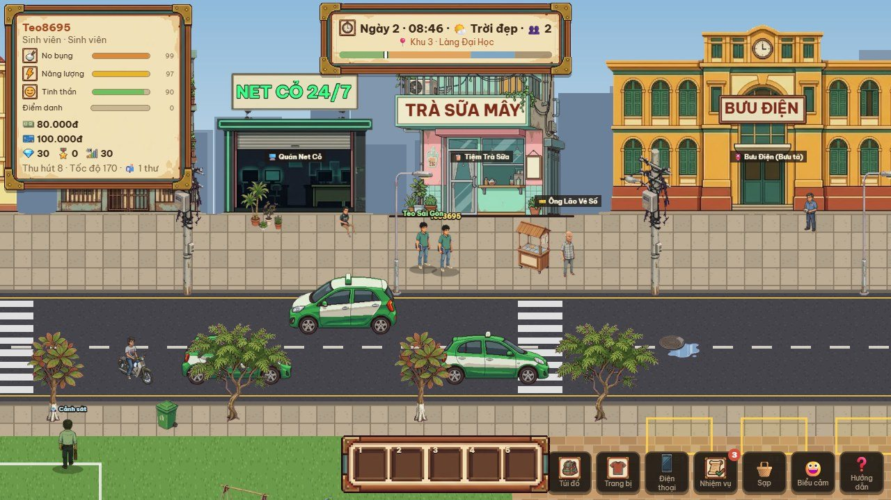
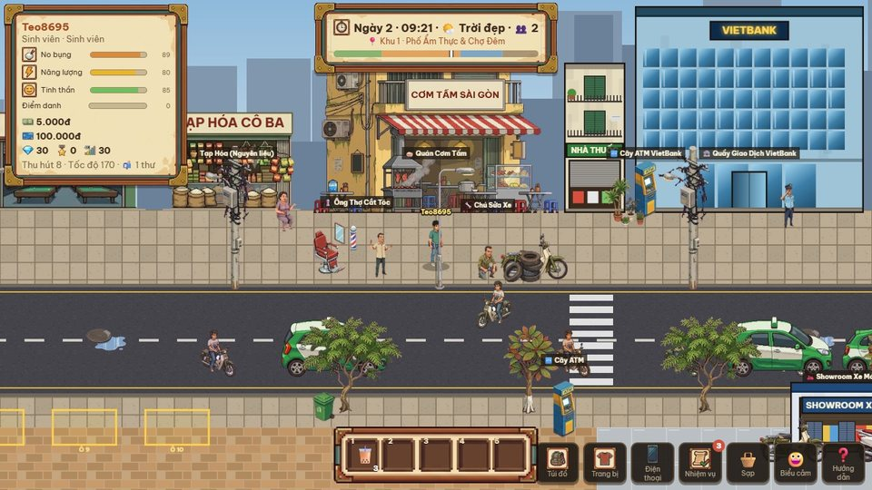
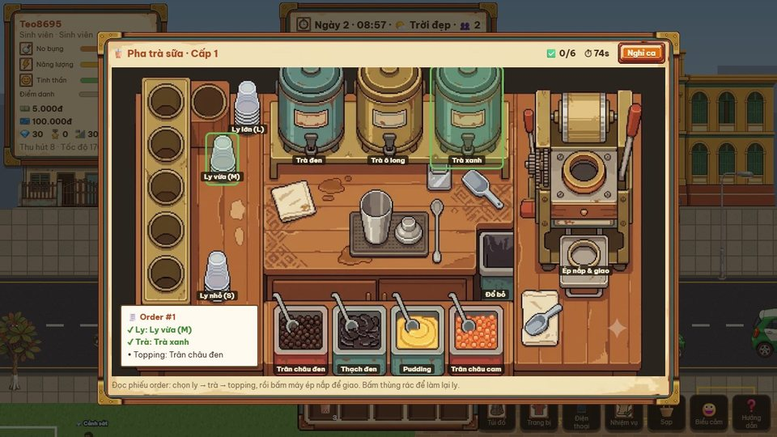
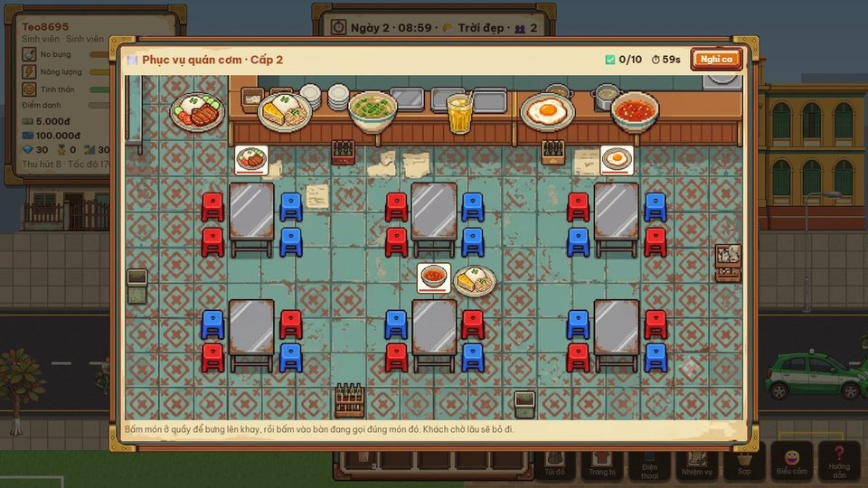
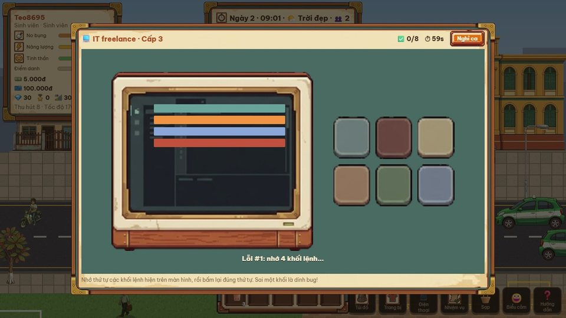
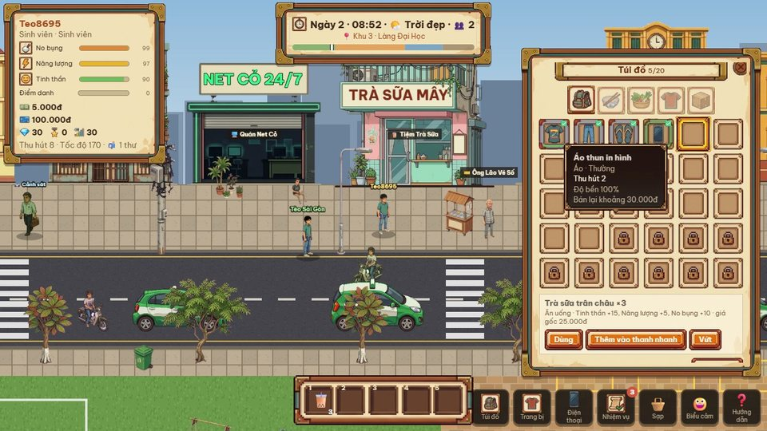
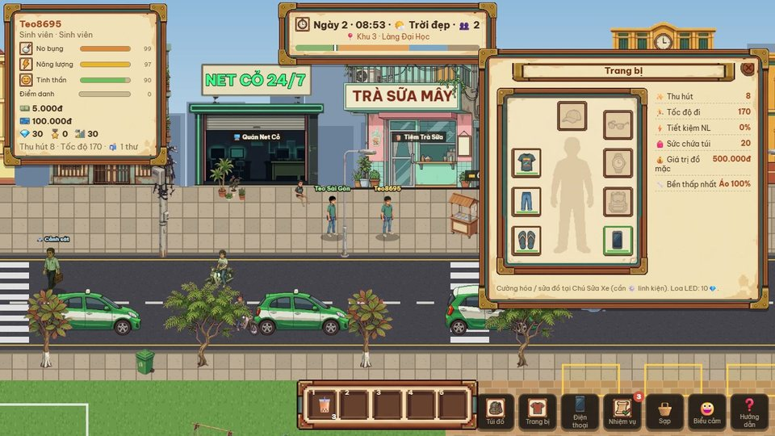
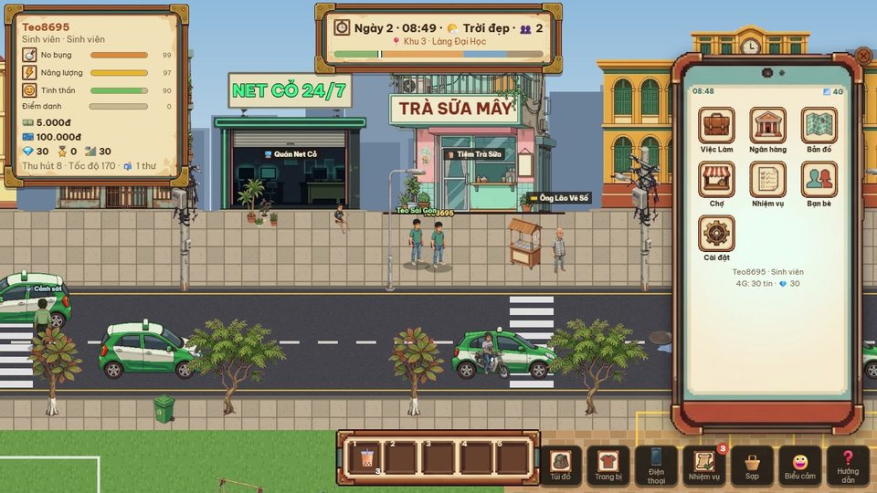
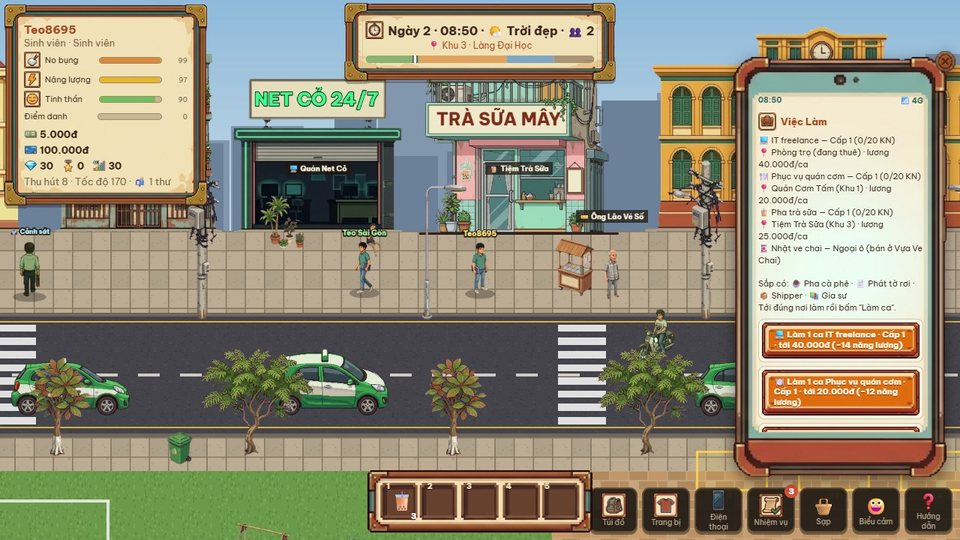

# HÀNG RONG · Phố Thị Online

**Sống một đời Sài Gòn — ngay trên trình duyệt.**

*Đi học, đi làm thêm, ăn cơm tấm vỉa hè, bày sạp, tán gẫu bên ly trà đá cùng cả thành phố.*

  

---

##  Chào mừng tới phố

Một thành phố pixel nhỏ mang hồn Sài Gòn: taxi xanh len lỏi giờ tan tầm, bà cụ bánh mì đứng góc phố, ông lão vé số rao từng tờ, khói sườn nướng bay ra từ quán cơm tấm, đèn đường bật sáng lúc chợ đêm vừa mở. Mọi người bạn gặp trên phố đều là người chơi thật — cùng làm ăn, cùng trò chuyện, cùng giữ gìn khu phố của mình.

<i>Phố Ẩm Thực: Quán Cơm Tấm Sài Gòn, Tạp Hóa Cô Ba, ông thợ cắt tóc vỉa hè, chú sửa xe.</i>

##  Sống như người Sài Gòn

<table>
<tr>
<td width="33%" align="center"> <b>No bụng</b> Đói thì kiếm dĩa cơm tấm sườn, ổ bánh mì nóng giòn.</td>
<td width="33%" align="center"> <b>Năng lượng</b> Đi bộ, đi làm đều mệt — ăn uống, về trọ ngủ một giấc.</td>
<td width="33%" align="center"> <b>Tinh thần</b> Làm việc căng thẳng? Một ly trà sữa trân châu là vui lại.</td>
</tr>
</table>

Mỗi ngày có **3 nhiệm vụ** mới  — làm xong cả ba nhận thêm kim cương.

##  Đi làm thêm — mỗi ca là một mini-game

Làm bất kỳ lúc nào bạn muốn. Làm càng chuẩn lương càng cao, lên **cấp nghề 1 → 5** để nhận ca lương khá hơn.

<table>
<tr>
<td width="33%"></td>
<td width="33%"></td>
<td width="33%"></td>
</tr>
<tr>
<td align="center">🧋 <b>Pha trà sữa</b> Đọc phiếu order, chọn ly – trà – topping, ép nắp giao khách.</td>
<td align="center">🍽️ <b>Phục vụ quán cơm tấm</b> Bưng đúng món ra đúng bàn trước khi khách bỏ đi.</td>
<td align="center">💻 <b>IT freelance</b> Nhớ thứ tự khối lệnh rồi gõ lại — sai một khối là dính bug.</td>
</tr>
</table>

Sắp có: pha cà phê phin, phát tờ rơi, shipper, gia sư. Vẫn có thể nhặt ve chai ở Ngoại Ô đem bán cho vựa.

##  Túi đồ, trang bị & chiếc điện thoại

<table>
<tr>
<td width="50%"></td>
<td width="50%"></td>
</tr>
<tr>
<td align="center"><b>Túi đồ dạng lưới</b> Lọc theo loại, viền ô theo độ hiếm, rê chuột so sánh với món đang mặc. Thanh dùng nhanh phím 1–5.</td>
<td align="center"><b>Trang bị "búp bê giấy"</b> 8 ô: nón, kính, áo, đồng hồ, quần, balo, giày, điện thoại — tăng Thu hút, Tốc độ, Tiết kiệm năng lượng.</td>
</tr>
<tr>
<td width="50%"></td>
<td width="50%"></td>
</tr>
<tr>
<td align="center"><b>Chiếc điện thoại là cả thế giới</b> Việc Làm, Ngân hàng, Bản đồ (bấm là tự đi tới), Chợ online, Nhiệm vụ, Bạn bè.</td>
<td align="center"><b>App Việc Làm</b> Xem cấp nghề, lương từng ca và nơi làm.</td>
</tr>
</table>

##  Chọn đời của bạn

| | |
|---|---|
| 🎓 **Sinh viên** | Điểm danh giảng đường, làm thêm ở quán, lượm ve chai. Ra trường rồi nộp CV — đời sẽ khác. |
| 💼 **Nhân viên văn phòng** | Chấm công đúng giờ, chạy KPI, lương về tài khoản mỗi chiều. Tiết kiệm sinh lãi, leo lên ghế Giám đốc. |
| 🧺 **Tiểu thương** | Nhập nguyên liệu, làm bánh mì – pha trà đá – ép nước mía, bày sạp ở ô quy hoạch. Từ gánh hàng rong thành chuỗi thương hiệu. |

##  Phố không bao giờ ngủ

- 🏙️ **4 khu phố liền mạch** — Làng Đại Học, Phố Ẩm Thực & Chợ Đêm, Trung Tâm Tài Chính, Ngoại Ô & Bãi Phế Liệu.
- 🛒 **Kinh tế do người chơi làm chủ** — bày sạp, mua bán trực tiếp, phiên đấu giá biển số đẹp và đồ giới hạn lúc 20:00.
- 🦹 **Phố có luật, cũng có rủi ro** — giữ nhiều tiền mặt dễ bị móc túi, giang hồ ghé đòi tiền bảo kê, bày sạp lấn chiếm là Cảnh sát tới phạt.
- 🌧️ **Thời tiết Sài Gòn thật** — mưa ngập sạp không dù che là ế; nắng gắt thì nước mía bán đắt như tôm tươi.
- 🌃 **Ngày & đêm** — sáng đông dân văn phòng, tối phố lên đèn neon, chợ đêm nhộn nhịp.
- 💬 **Tán gẫu như ngoài phố** — bong bóng chat to nhỏ theo khoảng cách, kênh thế giới, và Loa LED chạy chữ cầu vồng cho cả server.

##  Chơi ngay

Game chạy thẳng trên trình duyệt — không cần cài đặt. Máy chủ miễn phí sẽ "ngủ" khi vắng người; lần đầu mở có thể chờ khoảng 30–60 giây để phố thức dậy.

| Phím | Tác dụng | Phím | Tác dụng |
|:---:|---|:---:|---|
| `WASD` / chuột | Đi lại | `E` / bấm NPC | Nói chuyện, vào quán |
| `I` | Túi đồ | `C` | Trang bị |
| `P` | Điện thoại | `Q` | Nhiệm vụ hôm nay |
| `1`–`5` | Dùng nhanh món ăn | `Enter` | Chat |

##  Nhật ký phát triển

Thành phố đang được xây từng ngày. Mỗi chặng — làm gì, vì sao, còn vướng gì — đều được ghi lại trong **[📜 Nhật ký phát triển (GAMELOG)](docs/GAMELOG.md)**.

| Ngày | Có gì mới |
|---|---|
| 2026-10-07 | Giao diện mới kiểu giấy – gỗ, 3 nhu cầu, nhiệm vụ ngày, **đi làm thêm với 3 mini-game**, Quán Cơm Tấm & Tiệm Trà Sữa, túi đồ dạng lưới, điện thoại có app |
| 2026-10-06 | Thiết kế lại gameplay V2 · dựng lại cả thành phố bằng pixel art mới · lưu trữ PostgreSQL · bản chơi online đầu tiên |

Sắp tới: phòng trọ trang trí được, nấu ăn, Chợ Sạp Hàng Hóa, xe buýt, Trung Tâm Mua Sắm & máy Gacha… Xem [**lộ trình**](docs/ROADMAP.md) và [**thiết kế V2**](docs/GAMEPLAY_V2.md).

Muốn tự dựng máy chủ hoặc đóng góp? Xem [**Hướng dẫn phát triển**](docs/DEVELOPMENT.md).

---

*Làm bằng tình yêu với những con phố Sài Gòn* 🇻🇳

